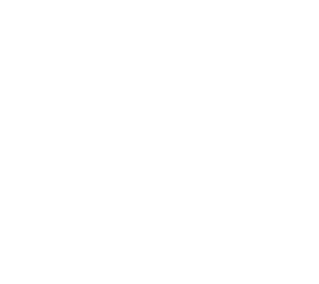
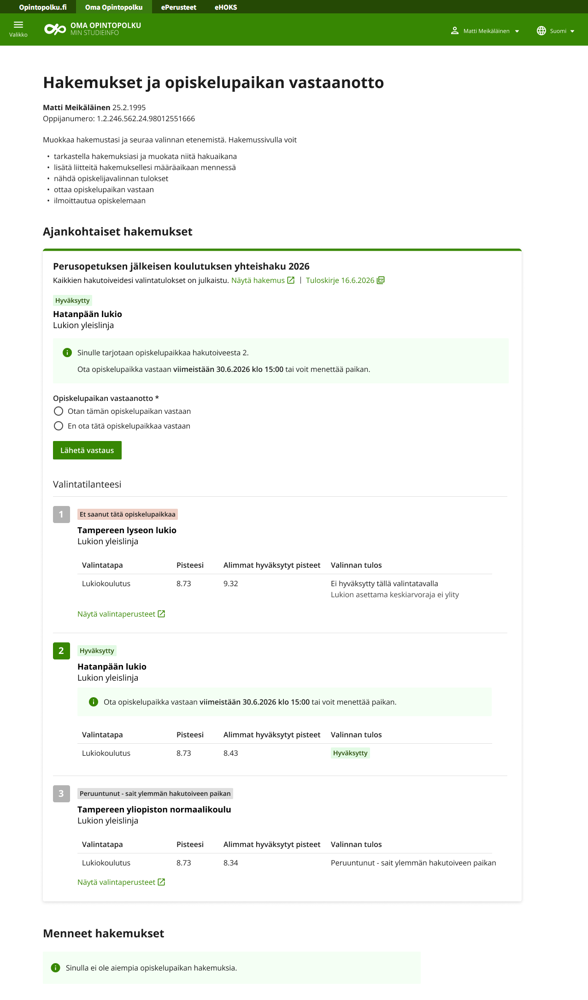
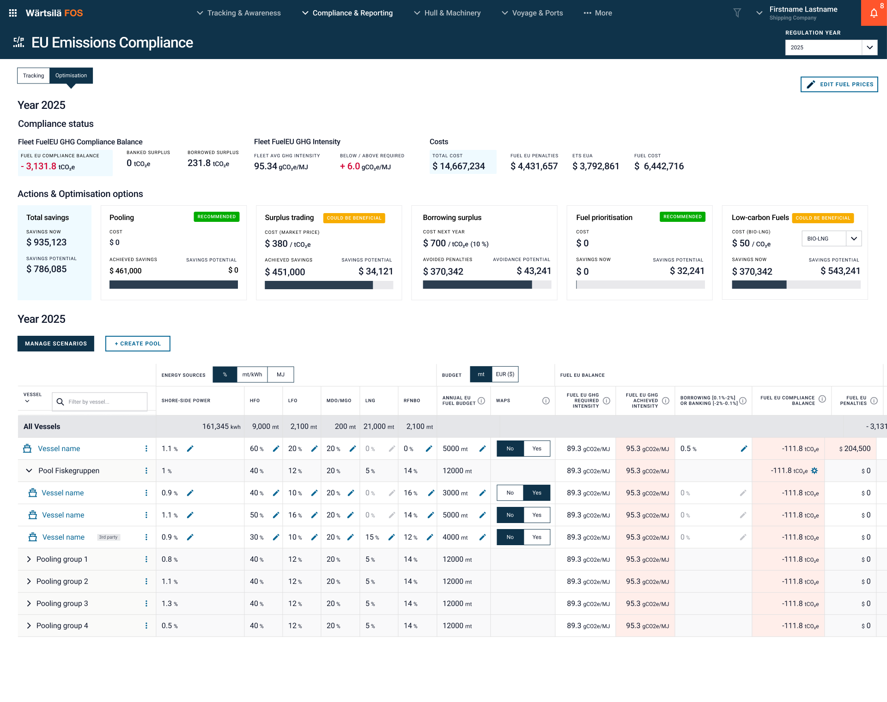
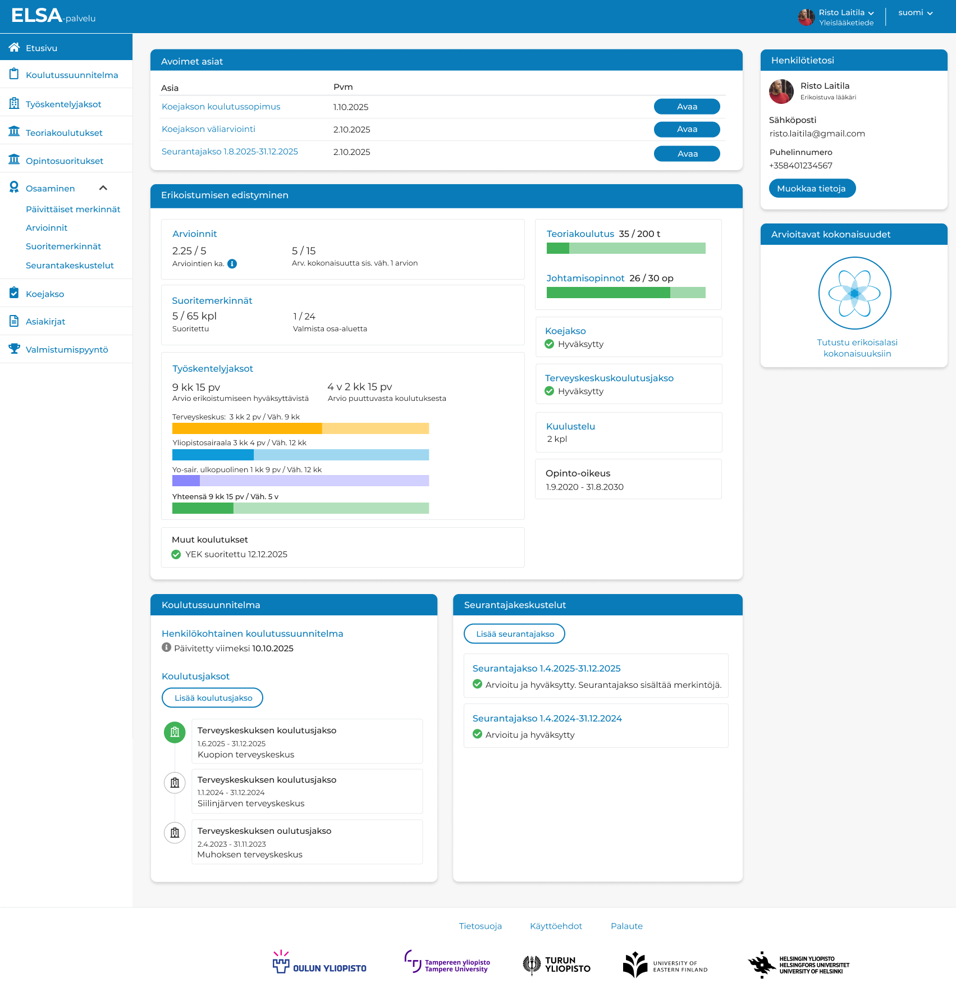

<!DOCTYPE html>
<html lang="en">
<head>
  <meta charset="UTF-8">
  <meta name="viewport" content="width=device-width, initial-scale=1.0">
  <meta name="robots" content="noindex">
  <link rel="icon" href="data:,">
  <title>Arto Seppänen — Senior UX Designer</title>  
  <link rel="preconnect" href="https://fonts.googleapis.com">
  <link rel="preconnect" href="https://fonts.gstatic.com" crossorigin>
  <link href="https://fonts.googleapis.com/css2?family=Charis+SIL:ital,wght@0,400;0,700;1,400;1,700&family=DM+Sans:ital,opsz,wght@0,9..40,100..1000;1,9..40,100..1000&family=Open+Sans:ital,wght@0,300..800;1,300..800&display=swap" rel="stylesheet">
  <link rel="stylesheet" href="styles.css">
  
</head>
<body>
<a href="#esittely" class="skip-link">Hyppää osaamiseen</a>

<!-- ── NAV ── -->
<nav>
  <a href="#hero" class="nav-logo">Arto Seppänen</a>
  <ul class="nav-links">
    <li><a href="#esittely">Osaaminen</a></li>
    <li><a href="#tyokokemus">Työkokemus</a></li>
    <li><a href="#portfolio">Portfolio</a></li>
    <li><a href="#palautteita">Palautteita</a></li>
    <li><a href="#yhteys">Yhteys</a></li>
  </ul>
  <button class="hamburger" id="ham" aria-label="Avaa valikko">
    
  </button>
</nav>

<!-- ── MOBILE MENU ── -->
<nav class="mobile-menu" id="mob" aria-label="Navigaatio" aria-hidden="true">
  <a href="#esittely" class="mob-link">Osaaminen</a>
  <a href="#tyokokemus" class="mob-link">Työkokemus</a>
  <a href="#portfolio" class="mob-link">Portfolio</a>
	<a href="projekti1.html" class="mob-link sublevel">Opetushallituksen Oma opintopolku</a>
	<a href="projekti2.html" class="mob-link sublevel">Wärtsilä FOS</a>
	<a href="projekti3.html" class="mob-link sublevel">ELSA-palvelu</a>
  <a href="#palautteita" class="mob-link">Palautteita</a>
  <a href="#yhteys" class="mob-link">Yhteys</a>
</nav>

<main id="main-content">

  <!-- ── HERO ── -->
  <section id="hero">
  

    
    

    

      
ARTO SEPPÄNEN&nbsp;·&nbsp;SENIOR / LEAD UX DESIGNER&nbsp;·&nbsp;TAMPERE

      <h1>Hei, kiva kun kiinnostuit</h1>
      
Suunnittelen digitaalisia palveluita, jotka ovat selkeitä, tarkoituksenmukaisia ja rakennettu oikeita ihmisiä varten, ei oletusten pohjalta.

      <a href="#esittely" class="portfolio-link">Tutustu osaamiseen ↓</a>
	

	  
  

  </section>

  <!-- ── osaaminen ── -->
  <section id="esittely">
  

  
    <h2>Osaaminen</h2>
	
Yli 20 vuoden kokemus käyttäjälähtöisestä verkkopalveluiden suunnittelusta yksityiseltä ja julkiselta puolelta, kotimaisista sekä kansainvälisistä palveluista.

	<h3 style="padding-top: 32px;">Mitä tuon tiimiinne kokeneena suunnittelijana?</h3>
    

      

        <h4>Laatua</h4>
        
Varmuutta ja rivisuunnittelijoista erottuvaa taitoa ratkaista haasteita ja viedä projektia eteenpäin parhaalla tavalla – eikä vain tekemään sitä, mikä näyttää tai tuntuu kivalta.

      

       

        <h4>Ymmärrystä ja tehokkuutta</h4>
        
Kuuntelen aidosti asiakkaita: Kyky löytää tiiviistäkin liiketoiminnan speksistä tai käyttäjän sanoista oleellisin tieto ja kääntää se käyttäjätarinoiksi ja toimivaksi prototyypiksi.

      

       

        <h4>Uskallusta</h4>
        
Rohkeutta katsoa asioita tuoreesta kulmasta uusia toimivampia ratkaisuvaihtoehtoja ehdottaen ja kyseenalaistaen vallitsevaa tilannetta.

      

	      

        <h4>Monipuolisuutta</h4>
        
Osaamista softakehityksen ja suunnitteluprosessin kaikista eri vaiheista, kipupisteistä ja parhaista käytännöistä.

      
 
	

  	

	
	<h3>Ydinosaaminen</h3> 
	

	  
		

			

 
			<h4>Suunnittelu</h4>
			
Käyttäjäkokemuksen, käyttöliittymien ja vuorovaikutteisten prototyyppien laadukas ja huolellinen suunnittelu asiakasymmärryksen ja speksien pohjalta.

		

		   

		   

 
			<h4>Käyttäjätestaus</h4>
			
Olen kehittänyt tehokkaan toimintamallin käyttäjätestaukseen, jolla konseptin toimivuus voidaan varmistaa jo varhaisessa vaiheessa ennen toteutusta säästäen suuresti kustannuksissa.

		

		
		

		

 
			<h4>Käyttäjätutkimus</h4>
			
Asiakasymmärrys syntyy mm. haastattelujen, keskustelujen, kyselytutkimusten, katselmointien, palautteen keruun ja analysoinnin sekä sivustoanalytiikan kautta.

		
    
	  

	  

	  <h3>Työskentelyn tapoja</h3> 
		

			 

			 

 
				<h4>Responsiivinen ajattelutapa</h4>
				
Ei vain desktop-leiskaa vaan mobiili suunnitellaan samanaikaisesti muiden näyttöleveyksien kanssa.

			  

			  

			  

 
				<h4>Visuaalinen suunnittelu</h3>
				
Ei vain rautalankoja vaan valmis design, joka toimii tarkkana speksinä kehittäjille ja vähentää dokumentoinnin tarvetta projektissa.

			  

			  

			  

 
				<h4>Sisältösuunnittelu</h4>
				
Ei vain lorem ipsumeja, koska käyttöliittymätekstit ja sisältöesimerkit ovat olennainen osa onnistunutta käyttökokemusta ja toimivaa suunnittelua.

			  

			  

			  

 
				<h4>Saavutettavuus</h4>
				
Ei vain kivoja kuvia ja toimintoja vaan oikeasti saavutettava palvelu kaikille. Tuki myös toteutukseen.

			

		

		
		<ul>
			<li>Kokemusta satojen devaajien kanssa työskentelystä osana kotimaisia ja kansainvälisiä scrum- ja safe-tiimejä. Taitoa vähentää koodarin hikeä ja kuluja järkevillä ratkaisuilla. Eri versiot, mvp-ratkaisut ja priorisointi luonnollisena osana iterointia ja matkaa kohti valmista tuotetta.</li>
			<li>Työskentelen tälläkin hetkellä usean tiimin, projektin ja palvelun kanssa samanaikaisesti, jolloin nopea kontekstin vaihto ja yhdenmukaisuuden (mm. design-systeemit) huomioiminen on arkipäivää. </li>
			<li>Osallistun käyttäjälähtöiseen määrittelytyöhön ja teen tiiviisti yhteistyötä tuoteomistajan kanssa. Olen hyvin tavoitettavissa.</li>
			<li>Ketterä lähestymistapa tekemiseen ja työnkulkuun. Tuon tiimeihin fail early -ajattelutapaa, joka käyttäjien osallistamisen kanssa pitää kulut matalina. En rakastu omiin design-ideoihin ja pidä niistä kynsin hampain kiinni.</li>
			<li>Osallistun mielelläni myös lopulliseen käyttöliittymätestaukseen ja olen tottunut speksaamaan toimintoja Jiraan suoraan kehittäjille. Hyvä ymmärrys fronttipuolen tekniikoista aiempien css/html-toteutusten myötä.</li>
			<li>Tekoäly mukana sparraamassa ja tehostamassa työnkulkua.</li>
		</ul>

    

  </section>

  <!-- ── tyokokemus ── -->
  <section id="tyokokemus">
  

  
 <h2>Työkokemus</h2>

    

      
4/2017 — jatkuu

      

      

        
Senior UX Designer

        
Gofore

        
Ux-töitä asiakkaille Wärtsilä, Opetushallitus, Oulun Yliopisto, Verohallinto, Keha-keskus, DVV, Aimo Park. Kotimaiset ja kansainväliset tiimit.

      

    

    

      
10/2010 — 4/2017

      

      

        
Senior UX Designer

        
Tieto Finland Oy

        
Ux-töitä asiakkaille Metsä Group (Wood, Fibre, Board, Tissue), Kesko, Helsingin Energia, Ilmarinen, Sampo Group, Lähitapiola, Turva, Alma Media. Kotimaiset ja kansainväliset tiimit.

      

    

    

      
4/2010 — 10/2010

      

      

        
Web Graphic Designer

        
Gemilo

        
Verkkosivustojen ja sosiaalisen intranet -tuotteen suunnittelu sekä css/html/mako-taitto.

      

    

    

      
2/2006 — 4/2010

      

      

        
Web Designer

        
Grey-Hen

        
Autoalan hinnoittelu- ja raportointituotteiden design lead. Yritysilmeen suunnittelu, markkinointimateriaalit.

      

	  
	  

	  
	   <h3 style="padding-top: 24px;">Koulutus</h3>
	       

	   
1/2003 — 1/2007

	     

		 

	   
Medianomi (AMK)

	   
Tampereen Ammattikorkeakoulu - taide ja viestintä

	    Koulutusohjelma: vuorovaikutteinen media
	   

    

  </section>

  <!-- ── portfolio ── -->
  <section id="portfolio">
  

   
    <h2>Portfolio - muutamia projektiesittelyjä</h2>
   

    

      

        
        
Opetushallituksen Oma opintopolku

       <h4><a href="projekti1.html">Sujuvampi opiskelupaikan vastaanotto ja moniteemaisen design-systeemin kehitys isolle julkiselle organisaatiolle</a></h4>
        
        <a href="projekti1.html" class="portfolio-link">Tutustu projektiin</a>
      

      

        
        
Wärtsilä FOS

         <h4><a href="projekti2.html">Datapohjaista ja käyttäjälähtöistä tuotesuunnittelua merenkulkualan globaaleille toimijoille</a></h4>
        <a href="projekti2.html"  class="portfolio-link">Tutustu projektiin</a>
      

      

        
        
Elsa-palvelu

        <h4><a href="projekti3.html">Erikoislääkäreiden koulutuksen edistymisen palveluportaali</a></h4>
        <a href="projekti3.html" class="portfolio-link">Tutustu projektiin</a>
      

   
 

  </section>

  <!-- ── palautteita ── -->
  <section id="palautteita">
  

    
    <h2>Palautteita asiakkailta</h2>

    

	

	

		<h4>"Proaktiivinen, tehokas, erinomainen työn jälki, helppo kommunikoida ja tehdä yhteistyötä."</h4>
		
Tuoteomistaja

      

	
	

		<h4>"Tarpeiden kuuntelu ja ymmärtäminen, laadukas työn jälki, hyvän työilmapiirin ylläpitäminen, luotettavuus. Aktiivinen ja nopea yhteydenpito sekä ratkaisu- ja asiakaskeskeinen lähestymistapa tekemiseen."</h4>
		
Tuotepäällikkö

      

      

	    <h4>Arto ymmärtää hyvin nopeasti asiakastarpeet ja monimutkaiset kokonaisuudet. Arton kanssa on mukava työskennellä." </h4>
		
Projektin vetäjä

      
 

	
  
		<h4>"Arto on todella osaava. Hänellä on hyvä ymmärrys projektiemme ja ulkoisten asiakkaidemme tarpeista ja hän osaa ottaa ne hyvin huomioon suunnittelutyössä."</h4>
		
Tuoteomistaja
  
	

	
	

		<h4>"Nopea, kuunteleva, analyyttinen ja tehokas. Hyvää jälkeä!"</h4>
		
Projektin vetäjä

      

	  
    <!-- 
  
	  <h4>"Järjestelmän suunnittelu Arton kanssa on ollut erittäin sujuvaa. Hän on hyvä kuuntelemaan ja ymmärtämään tarpeitamme sekä esittämään toimivia ideoita, joita emme itse osaisi ajatella. Järjestelmään on ollut tarpeen rakentaa paikoin monimutkaisiakin toiminnallisuuksia, ja niidenkin kehittämisessä Arto on hienosti onnistunut, ja ratkaisuja on ollut mukava pohtia yhdessä."</h3>
	  
Tuotepäällikkö
  
   
-->

    

  </section>

  <!-- ── yhteys ── -->
  <section id="yhteys">
  

    <!--05-->
    <h2>Tehdään yhdessä Internetistä valmis.</h2>
    

    

	

         
      

	
	
	
      

        
SÄHKÖPOSTI

        <a href="mailto:arto.seppanen@gmail.com" class="yhteys-val">arto.seppanen@gmail.com</a>
		
		    
PUHELIN

        <a href="tel:+358407405927" class="yhteys-val">+358 40 740 5927</a>
      

	  
	 
     
    
   
     

    

  </section>

</main>

<!--<footer>
  
© 2026 Arto Seppänen 

  </footer>-->

</body>
</html>
